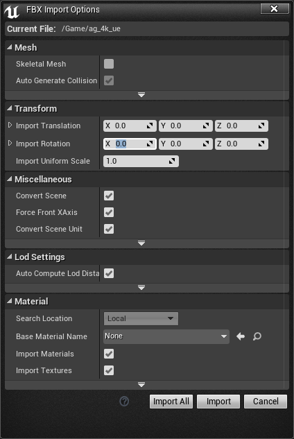

# Importing Seurat Meshes Into Unreal

Seurat is a scene simplification technology designed to process very complex 3D scenes into a representation that renders efficiently on mobile 6DoF VR systems.

This document covers how to import Seurat meshes into Unity. To learn more about the Seurat pipeline, visit the main [Seurat GitHub page](https://github.com/googlevr/seurat).

## Introduction
This document describes the process to import the output of the Seurat pipeline
(generated from any source capture) into Epic Games’ Unreal Engine.  The
document assumes some familiarity with the Unreal Engine, and is written against
version 4.16.

## Import Instructions
Follow these steps:

### Setup
1. Start the Unreal Editor.
2. Create a new blank project, with no starter content.
3. Locate the _Content Browser_ panel, typically at the bottom of the Editor
   main window.
4. Locate the folder containing the Seurat output .OBJ, .EXR files. Give them
   separate file names, as Unreal requires unique names for each asset.
5. Disable some rendering settings that interfere with Seurat rendering:
6. _Edit | Project Settings_
7. Locate the _Translucency_ group
8. Disable _Separate Translucency_
9. Locate the _Default Settings_ group
10. Disable _Bloom,_ _Ambient Occlusion,_ and _Auto Exposure_
11. Prepare Light Source for Unlit
12. Locate the _Light_ group
13. Set _Intensity_ to 8.0
14. Disable _Cast Shadows_

### Import the OBJ Model
1. Click the _Import_ button near the top left corner of the _Content Browser_
   panel.
2. Navigate to the folder containing the Seurat .OBJ, .PNG, and .EXR file.
3. Select the .OBJ file and the .EXR file (.PNG import has some artifacts).
4. Click the _Open_ button.
5. The Editor displays a model import configuration dialog.\
   
6. Change the Import Rotation X axis to 90.0.
7. If the Seurat capture was processed in meters, then change the Import Uniform
   Scale to 100.0 to scale the geometry to centimeters.
8. Click the _Show Advanced_ rollout in the Mesh options group.
9. Disable _Build Adjacency Buffer._
10. Disable _Generate Lightmap UVs._
11. Click Import.
12. The Editor will import the model and show an icon for it in the _Content
    Browser._
13. Double click the asset icon.
14. The Editor will display the Model configuration editor.
15. Locate the _Details_ panel.
16. Enable _Use Full Precision UVs_ (to prevent crack artifacts).
17. Locate the LOD0 options group.
18. Expand the Build Settings subgroup.
19. Check _Use Full Precision UVs._
20. Finally, place the Seurat mesh into the scene by clicking the imported asset
    icon in the _Content Browser_ window and dragging it into the viewport.

### Import the Texture
1. Click the _Import_ button near the top left corner of the _Content Browser_
   panel.
2. Navigate to the folder containing the Seurat .OBJ, .PNG, and .EXR file.
3. Select the .OBJ file and the .EXR file (.PNG import has some artifacts: [1][png_01],[2][png_02],[3][png_03]).
4. Click the _Open_ button.
5. The Editor will add the texture asset to the _Content Browser_ panel.
6. Double click the texture.
7. The Editor will display the Texture editor in a new window.
8. Locate the _Details_ panel.
9. If the input EXR is not HDR, change the compression type to RGBA or DXT1/5.

### Create the Material
1. Click the _Add New_ button near the top left corner of the _Content Browser_
   panel.
2. Click _Material_ in the _Create Basic Asset_ group.
3. The Editor will add a material with the name _NewMaterial_ in the _Content
   Browser._
4. Double-click _NewMaterial_ to open it in the Material editor.
5. Run the _File | Save As..._ command and give the material a meaningful name,
   e.g. _SeuratMesh._
6. Click Save.
7. Locate the _Details_ panel.
8. In the Material options group, change the _Blend Mode_ to _Translucent._
9. Configure _Shading Model_ to _Unlit._
10. In the material graph viewport, add a TextureSample node.
11. Right click, open the Texture group, locate TextureSample and click it.
12. Connect the RGB (white circle) output from the TextureSample node to the
    _Emissive Color_ input in the _SeuratMesh_ node.
13. Connect the alpha (gray circle, near the bottom) output from the
    TextureSample node to the _Opacity_ input in the _SeuratMesh_ node.
14. Save the material.

[png_01]: https://answers.unrealengine.com/questions/384955/texture-will-fill-empty-areas-with-lines.html
[png_02]: https://forums.unrealengine.com/showthread.php?22982-Importing-any-PNG-with-alpha-channel-messes-up-the-image
[png_03]: https://answers.unrealengine.com/questions/87474/while-importing-a-sprite-sheet-texture-unreal-is-a.html

DISCLAIMER: This is not an officially supported Google product.
